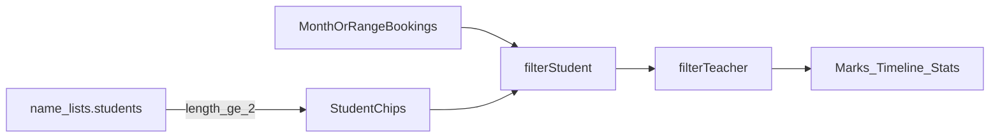

# 学员过滤与青春跳脱 UI 调整

> **For agentic workers:** 实现时按 task 推进；纯函数优先 TDD（`node miniprogram/utils/*.test.js`）。

**Goal:** 多学员时可按孩子过滤查询/统计（默认全部，单孩隐藏过滤）；全站视觉往青春跳脱收一点，但不靠信息变吵；日历色点仍表示老师。

**Architecture:** 客户端在现有月/区间约课列表上叠加 `filterStudent`（`''` = 全部），与现有 `filterTeacher` 串联；学员选项来自 `name_lists.students`，`length < 2` 不渲染过滤条。不改云函数与 booking schema。UI 抛光落在 filter-chips、日历顶区、概览与空状态，不动色点语义。

**Tech Stack:** 微信小程序；现有 `filter-chips`；`prefs` 本地记忆；Node assert 单测。

**Agreed decisions（已锁定）：**
- 默认视图 = 全部学员；无强制「当前默认孩子」
- 单学员不显示学员过滤
- 写入仍可选任意学员（联想匹配）；从「已筛某孩」进新增时可预填，仍可改
- 色点 / 图例 = 老师（不改 `calendar-marks`）
- UI 跳脱 = 色、圆、短动效、插画；本轮不做全站换肤/Greeting Header/孩子进 Tab
- 本轮 UI 范围 = 日历 + 概览 + 空状态 + chips；新增页仅加多孩快捷点选，不重做表单

---

## File map

| 文件 | 职责 |
|------|------|
| [docs/superpowers/specs/2026-08-06-student-filter-and-ui-direction.md](docs/superpowers/specs/2026-08-06-student-filter-and-ui-direction.md) | **新建**设计说明（已讨论定稿） |
| [docs/superpowers/plans/2026-08-06-student-filter-and-ui-direction.md](docs/superpowers/plans/2026-08-06-student-filter-and-ui-direction.md) | **新建**本实现计划落盘副本 |
| [PRODUCT.md](PRODUCT.md) | Personality / Visual / Primary tasks 摘要更新 |
| [miniprogram/utils/student-filter.js](miniprogram/utils/student-filter.js) | **新建**过滤与 chip 构建纯函数 |
| [miniprogram/utils/student-filter.test.js](miniprogram/utils/student-filter.test.js) | **新建**单测 |
| [miniprogram/utils/prefs.js](miniprogram/utils/prefs.js) | `get/setFilterStudent` 本地记忆 |
| [miniprogram/pages/calendar/index.js](miniprogram/pages/calendar/index.js) / wxml | 学员条 + 串联过滤；进新增带预填 query |
| [miniprogram/pages/overview/index.js](miniprogram/pages/overview/index.js) / wxml / wxss | 学员范围 + 统计输入过滤 |
| [miniprogram/pages/overview-list/index.js](miniprogram/pages/overview-list/index.js) | 从概览带入 `studentName` 过滤 |
| [miniprogram/utils/overview-stats.js](miniprogram/utils/overview-stats.js) | 列表过滤支持 `studentName`（若尚未有） |
| [miniprogram/components/filter-chips/*](miniprogram/components/filter-chips) | 圆角/选中短动效；可区分 `variant`（student vs teacher） |
| [miniprogram/pages/booking-edit/index.*](miniprogram/pages/booking-edit) | 多孩时横向快捷选学员；接受 `studentName` query 预填 |
| 空状态相关组件/样式 | 轻插画气氛，短文案，不增信息墙 |
| `calendar-marks.js` / 云函数 | **不改** |

---

## Task 1: 规格与 PRODUCT 摘要

- 将对话中的调整说明写入 `docs/superpowers/specs/2026-08-06-student-filter-and-ui-direction.md`
- 将本计划写入 `docs/superpowers/plans/2026-08-06-student-filter-and-ui-direction.md`
- 更新 [PRODUCT.md](PRODUCT.md)：Primary tasks 增加「多学员时按学员筛选」；Personality/Visual 改为清晰可信 + 青春跳脱（色/圆/短动效/插画），去掉「去掉装饰插画」的绝对表述

---

## Task 2: 纯函数 `student-filter`（TDD）

**新建** `student-filter.js`：

- `shouldShowStudentFilter(students)` → `students.length >= 2`
- `filterByStudent(bookings, studentName)` → `''/falsy` 原样返回，否则 `b.studentName === studentName`
- `buildStudentChips(students, activeName)` → `[{ id:'all', label:'全部', active }, ...]`；`id` 用姓名；单测覆盖去重/空名单

跑通 `node miniprogram/utils/student-filter.test.js`。

---

## Task 3: prefs 记忆筛选

在 [prefs.js](miniprogram/utils/prefs.js) 增加独立 key（如 `pref:filterStudent`）：

- `getFilterStudent()` / `setFilterStudent(name)`
- 非法或名单中已不存在时，日历/概览加载后回退为 `''`（全部）

---

## Task 4: 日历页串联过滤

改 [calendar/index.js](miniprogram/pages/calendar/index.js) 的 `recomputeViews`：

1. 先 `filterByStudent`，再现有老师过滤
2. **老师 chips / 计数 / marks**：基于学员过滤后的列表（色点语义仍是老师）
3. **学员 chips**：来自名单；`shouldShowStudentFilter` 为 false 时 `studentChips = []` 且不渲染
4. `onStudentFilterChange` 写 prefs 并 `recomputeViews`
5. 新建入口（FAB/日区新增）若当前 `filterStudent` 非空，跳转带 `studentName=` 预填

WXML：在 `month-nav` 与老师 `filter-chips` 之间增加学员 `filter-chips`（`wx:if="{{studentChips.length}}"`）。

---

## Task 5: 概览 + 列表

- [overview/index.js](miniprogram/pages/overview/index.js)：拉取名单；多孩显示学员胶囊（与周期 chips 区分开，避免两排同款灰 chip）；`buildOverviewStats` 前先 `filterByStudent`
- 跳转 overview-list 时带上 `studentName`（若有）
- [overview-list](miniprogram/pages/overview-list/index.js) / [overview-stats](miniprogram/utils/overview-stats.js)：`filterOverviewList` 增加 `studentName` 条件；补单测

---

## Task 6: 新增页快捷选（轻量）

[booking-edit](miniprogram/pages/booking-edit)：

- `onLoad` 读 `studentName` query 预填（不影响手改）
- 名单 `>=2` 时，学员输入旁或下方展示横向快捷名字/头像，点选写入 `studentName`
- 不改为只读「当前孩子」

---

## Task 7: UI 抛光（克制）

在不增加信息密度的前提下：

- **filter-chips**：更大圆角已有则强化选中阴影/120–160ms 过渡；学员条可用更轻描边+小圆点前缀，与老师 tone 铺色区分
- **概览**：保持现有 ✦ / 黄线 / hero；学员范围控件融入 `ov-period` 一带，避免再堆品牌标题
- **空状态**：短句 + 现有/轻插画，不新增说明段落
- **禁止**：Greeting 大头、孩子进 Tab、色点改孩子、整页强换肤、多排装饰 pill

---

## Task 8: 验收

1. 1 个学员：日历/概览无学员过滤条
2. ≥2 学员：默认全部；切换后日历/时间线/概览数字正确；可与老师筛选叠加
3. 色点/图例仍为老师
4. 筛选某孩后新增，表单预填该孩且可改成其他孩并保存
5. 相关 `*.test.js` 通过

---

## 非本轮

- `studentId` 迁移、云函数按学员查询
- 全局「当前孩子」身份体系
- 我的/表单页全面视觉重做
- 孩子主题色整页换肤
